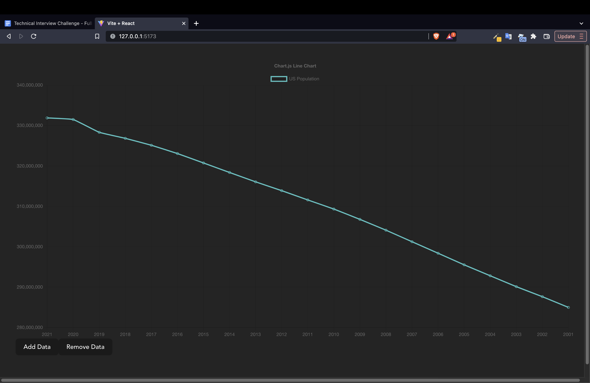

## Overview

This App uses [Chart.js](https://www.chartjs.org/) library to display us population data which you can find [here](https://project-awesome.org/jdorfman/awesome-json-datasets#population). Users can add or remove data by using the buttons (image below)



## Notes
When getting started I initially create my test cases via jest src/App.test.jsx. I wanted to test the main functionality of the feature which includes "Adding Data" "Removing Data" and "Reversing". I didn't consider that pushing data once we reverse the graph would cause an error. So I had to rewrite the reverse function so that it resets the the x & y data then reverses the data we reference before we copy the same amount before.

## Setup
* React 18
* React Router
* Jest & React Test Renderer (unit tests)
* Webpack 5 (module bundler)
* Babel 7+
* ESLint with Airbnb standards

## Install it

Just run `npm install` to install the dependencies.

## Run it

For active development you should run it with the following commands:

```bash
# Run it with watcher, so the process stays alive and it rerenders the page every time you apply a change to the code
npm run dev

# Run it once and generate the code in the dist folder
npm run start
```

## Run the unit tests

This repository comes with Jest unit testing library with Enzyme, for React support, it also includes coverage report with Instanbul that can be found in the `coverage` folder.

```bash
# You can run Jest with a watcher, so it updates when the code changes
npm run test:watch

# Run it once
npm run test 
# or 
npm test

# Run the coverage
npm run coverage
```
